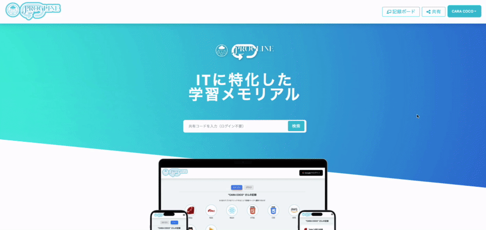
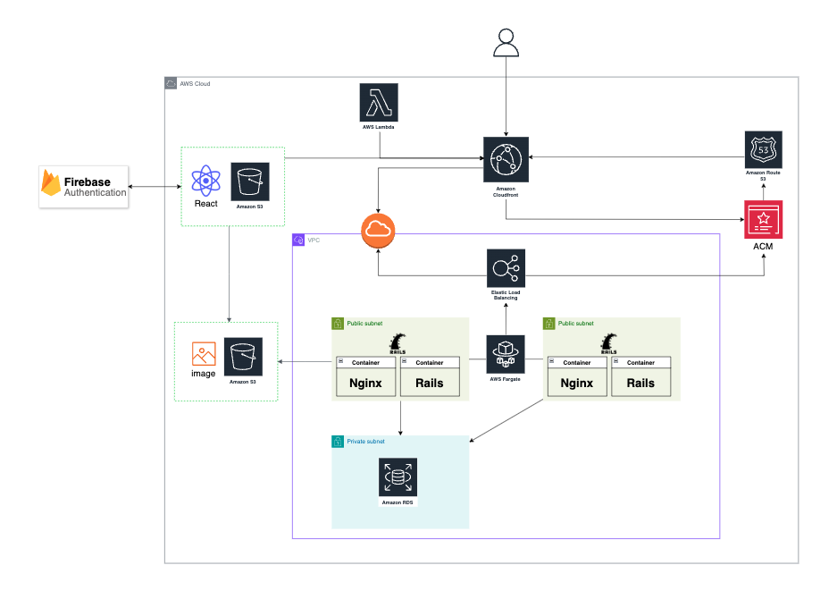

PROGLINE は IT 学習を記録し学習量の見える化を行える IT に特化した学習メモリアルです。

共有機能では知識の交流を促進、自分の記録を公開し、他人の学びも参考に技術力向上を促進します。

▼**サービス URL**

https://web.progline-tech.com/

 

---

 

## 主な機能

### ユーザー機能

| ログイン                                                                       | 学習を記録                                                                   |
| :----------------------------------------------------------------------------- | ---------------------------------------------------------------------------- |
|                                                  |                                         |
| ログインボタンを押すと、モーダルが立ち上がり Google ログインが可能になります。 | テンプレートやカスタム機能、リンクプレビューを使い学習を手軽に登録できます。 |

 

### シェア機能

| 共有                                                                       |
| :------------------------------------------------------------------------- |
|                                              |
| 共有機能を使って自分の記録を共有したり、他の人の記録を見ることができます。 |

 

---

 

## 主な使用技術

### フロントエンド

- React
- TailwindCSS

### バックエンド

- Ruby on Rails（API モード）

### インフラ

- AWS
  - Route53
  - CloudFront
  - S3
  - Certificate Manager
  - Elastic Load Balancing
  - Fargate
  - RDS(MySQL)

### 外部サービス

- Firebase Authentication

 

---

 

## インフラ構成図

 

## ER 図

 

## 画面遷移図

[Figma](https://www.figma.com/design/jbg4SbP95fVL8KiDPjQFZM/Progline?node-id=0-1&t=zcUpRHiPZzv5V7cn-1)
